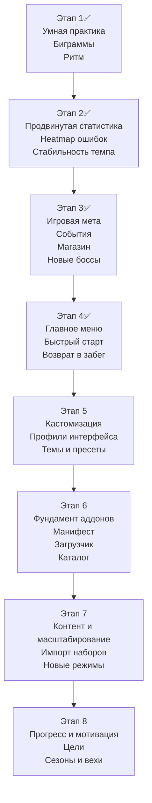

# ROADMAP

Идеи и направления для дальнейшего развития `Typing Trainer`.

## Приоритетные идеи

После закрытия этапов 1, 2, 3 и 4, приоритеты сейчас выглядят так:

1. Этап 5: углублять кастомизацию, пресеты, профили и доступность.
2. Этап 6: готовить фундамент для аддонов, чтобы новые режимы, контент и расширения не разрастались внутри основного кода.
3. Этап 7: импорт собственных текстов, контент-паки и масштабирование набора упражнений.
4. Этап 8: усиливать системы удержания — долгие цели, вехи мастерства, недельные и сезонные задачи.

## Карта развития

## Текущие задачи

Самый приоритетный этап на текущий момент: **этап 5 — Кастомизация и пользовательские профили**.

### Декомпозиция приоритетной задачи

Причина выбора: этапы 1–4 полностью закрыты. Этап 5 — следующий по приоритету: он углубит настройку визуала, добавит пресеты интерфейса и улучшит доступность.

**Фаза 1 — Минималистичный режим и настройки визуала: ✅**

- ✅ Добавить настройку «минималистичный режим»: скрывает все второстепенные панели во время активной печати.
- ✅ Добавить настройку плотности интерфейса (compact / default / comfortable).
- ✅ Расширить настройки клавиатуры: прозрачность рук, толщина обводок клавиш.
- ✅ Улучшить итоговые экраны режимов: более выразительная визуальная подача, анимации, акценты.

**Фаза 2 — Пресеты интерфейса: ✅**

- ✅ Добавить инфраструктуру пользовательских пресетов: сохранение текущего набора настроек под названием.
- ✅ Позволить переключаться между пресетами из настроек или главного меню.
- ✅ Предустановить 2–3 пресета: «Обучение», «Скоростная тренировка», «Игра».

**Фаза 3 — Доступность и полировка: ✅**

- ✅ Добавить настройки доступности: крупный текст, режим пониженной анимации, высокая контрастность.
- ✅ Расширить систему тем до настройки шрифтов, радиусов и анимаций.
- ✅ Поддержать экспорт и импорт пользовательских тем и конфигураций.

## 1. Обучение и качество тренировки

- ✅ Добавить полноценные уроки по рядам и биграммам, а не только по отдельным буквам.
- ✅ Сделать умную практику, которая чаще подсовывает слабые буквы, сочетания и проблемные переходы между пальцами.
- ✅ Добавить режим тренировки ритма, где важен ровный темп печати, а не только максимальная скорость.
- ✅ Ввести адаптивную длину упражнений: короткие добивочные сессии для слабых мест и длинные закрепляющие сессии для стабильности.
- ✅ Показывать после практики не только худшую букву, но и худшие сочетания, ряды и пальцы.

## 2. Статистика и аналитика

- ✅ Добавить базовые графики прогресса скорости и точности.
- ✅ Показать топ проблемных клавиш и скорость по клавишам.
- ✅ Построить аналитику умной практики по буквам, сочетаниям, пальцам, рядам и ритму.
- ✅ Добавить heatmap по ошибкам и проблемным зонам клавиатуры.
- ✅ Отображать стабильность темпа внутри одной сессии, чтобы видеть просадки и ускорения по ходу текста.
- ✅ Добавить сравнительные срезы: за день, неделю, месяц, по режимам, языкам и раскладкам.
- ✅ Добавить историю сессий и drilldown в конкретную попытку.
- ✅ Добавить больше сводных карточек и рекордов: лучшие периоды, стабильность, самые проблемные зоны, динамика улучшения.

## 3. Игровой режим и мета-прогрессия

- ✅ Добавить разные типы боссов: на точность, на стабильность темпа, на длинные тексты, на серии без ошибок.
- ✅ Ввести события между боссами: выбор пути, временные модификаторы, магазины, ремонт предметов, рискованные сделки.
- ✅ Расширить систему предметов: синергии, наборы, временные благословения на забег, редкие рискованные артефакты.
- ✅ Добавить ежедневный забег с фиксированными условиями и общим сидом.
- ✅ Сделать больше мета-решений внутри забега: выбор маршрута, развилки сложности, альтернативные награды, редкие комнаты.
- ✅ Добавить "призрак" предыдущего забега или лучшего результата, чтобы соревноваться с самим собой.
- ✅ Реализовать архетипы боссов (Снайпер, Метроном, Марафон, Абсолют) с уникальными условиями боя.
- ✅ Добавить систему наборов предметов (сеты) с бонусами за комплект.
- ✅ Добавить проклятия как тип события на карте маршрута.
- ✅ Перестроить карту маршрута на сегменты босс-босс с независимыми ветками.
- ✅ Реализовать elite- и miniboss-узлы на карте.
- ✅ Добавить seeded RNG для детерминированных ежедневных забегов.

## 4. Главное меню и стартовый опыт

- ✅ Добавить полноценный главный экран приложения с четкими точками входа: практика, уроки, тест, игровой режим, статистика и настройки.
- ✅ Сделать быстрые действия на первом экране: продолжить текущий забег, начать последнюю конфигурацию тренировки, открыть ежедневный режим, вернуться к незавершенному уроку.
- ✅ Вывести на главный экран краткую сводку прогресса: текущая раскладка, дневная цель, серия занятий, лучший недавний результат, прогресс обучения и игровой статус.
- ✅ Добавить блок "что делать дальше", который будет подсказывать следующий полезный шаг: открыть новую букву, добить слабую биграмму, завершить урок, продолжить забег, попробовать daily run.
- ✅ Продумать навигационный каркас между главным меню и внутренними экранами, чтобы приложение одинаково хорошо работало и как "панель режимов", и как "живой профиль игрока".
- ✅ Добавить карточки режимов с понятным позиционированием: чему помогает режим, сколько занимает времени, для кого он полезен и какой прогресс двигает.
- ✅ Поддержать состояние возврата: при запуске приложения сразу показывать активный прогресс, незавершенные активности и самые ценные точки продолжения.
- ✅ Добавить onboarding-поток для нового пользователя: выбор языка, раскладки, короткое объяснение режимов и мягкий первый сценарий входа.
- ✅ Подготовить место под будущие живые элементы главного меню: daily run, недельные задания, новости обновлений, новые достижения, избранные пресеты или аддоны.
- ✅ Добавить визуальный hero-блок или центральную "сцену" меню, чтобы приложение воспринималось как цельный продукт, а не только набор отдельных страниц.

## 5. Кастомизация и пользовательские профили ✅

- ✅ Добавить минималистичный режим без лишних панелей во время печати.
- ✅ Добавить настройку плотности интерфейса (compact / default / comfortable).
- ✅ Расширить настройки визуала: прозрачность рук, толщина обводок, размер экранной клавиатуры.
- ✅ Улучшить итоговые экраны режимов, чтобы они были более наглядными и "игровыми".
- ✅ Разрешить создавать и сохранять пользовательские пресеты интерфейса под разные сценарии: обучение, игра, спринт, стриминг.
- ✅ Расширить тему оформления до полноценной дизайн-системы с настройкой шрифтов, радиусов, анимаций.
- ✅ Поддержать экспорт и импорт пользовательских тем и конфигураций приложения.
- ✅ Добавить настройки доступности: крупный текст, режим пониженной анимации, высокую контрастность.
- ✅ Добавить гибкую настройку интерфейса по блокам: какие панели показывать, где располагать статистику, клавиатуру и игровые виджеты.
- ✅ Добавить отдельные профили настроек для разных раскладок и режимов, чтобы, например, практика и игра могли выглядеть по-разному.
- ✅ Добавить альтернативные цветовые схемы для дальтоников.

## 6. Система модификаций и аддонов ✅

- ✅ Добавить систему аддонов, которая позволит расширять приложение без изменения основного кода.
- ✅ Поддержать подключаемые пакеты с новыми словарями, уроками, раскладками, игровыми событиями и наборами предметов.
- ✅ Разработать формат манифеста аддона: метаданные, версия, совместимость, зависимости, список подключаемых ресурсов.
- ✅ Сделать безопасный загрузчик аддонов с валидацией структуры и версий, чтобы не ломать сохранения и совместимость.
- ✅ Добавить каталог установленных аддонов в настройках: включение, выключение, обновление, удаление.
- ✅ Поддержать пользовательские наборы контента как "легкие аддоны" без необходимости писать код.
- ✅ Рассмотреть API для модификаций, через которое можно будет добавлять новые игровые режимы, достижения, предметы, правила генерации текста и экраны результатов.
- ✅ Добавить импорт и экспорт аддонов, чтобы ими можно было делиться между пользователями.
- ✅ Подготовить "SDK-lite" или шаблоны для авторов аддонов, чтобы новые модификации можно было собирать без глубокого погружения в кодовую базу.
- В перспективе рассмотреть локальный каталог или встроенный браузер аддонов с установкой из интерфейса.

## 7. Контент и масштабирование

- Поддержать разные типы тренировочного материала: слоги, слова, псевдослова, предложения.
- Добавить импорт пользовательских текстов и собственных наборов упражнений.
- Подготовить основу под новые режимы: выживание, спринт, безошибочный режим, дуэль с призраком.
- Добавить тематические паки контента: программирование, офисный набор, литература, английские биграммы, числовые ряды.
- Разделить контент на базовый и расширяемый, чтобы новые языки, словари и сценарии могли жить как отдельные пакеты.

## 8. Прогресс, мотивация и цели

- Добавить долгосрочные цели и серии достижений: без ошибок, без потери жизней, победы подряд.
- Ввести личные рекорды по режимам, раскладкам и языкам.
- Показывать прогресс относительно предыдущих попыток прямо на экране результатов.
- Добавить цепочки достижений и “вехи мастерства” для каждой раскладки.
- Сделать сезонные или недельные задания, чтобы у игрока был повод регулярно возвращаться.
