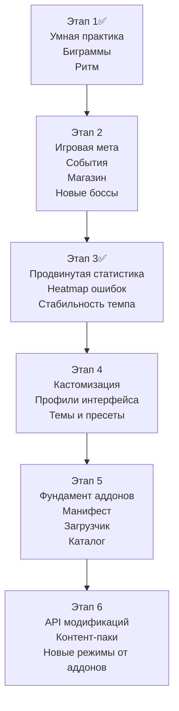

# ROADMAP

Идеи и направления для дальнейшего развития `Typing Trainer`.

## Приоритетные идеи

Если пересмотреть приоритеты с учетом кастомизации и будущей системы аддонов, то самый сильный эффект дадут такие шаги:

1. Умная практика по слабым буквам, биграммам и ритму печати.
2. События, магазин и более глубокая мета-структура игрового режима.
3. Продвинутая статистика по сочетаниям, стабильности темпа и ошибкам.
4. Гибкая кастомизация интерфейса с пресетами, профилями и экспортом настроек.
5. Фундамент системы аддонов: манифест, загрузчик, каталог и безопасное расширение контента.
6. Импорт собственных текстов, упражнений и пользовательских наборов контента.
7. Ежедневные забеги, призраки прошлых результатов и новые соревновательные режимы.

## Карта развития

## Текущие задачи

Самая приоритетная задача на текущий момент: перейти ко второму этапу и добавить мета-слой игрового режима, чтобы забег ощущался как полноценная игра, а не только цепочка уровней.

### Декомпозиция приоритетной задачи

- ✅ Закрыть первый этап умной практики, статистики и уроков.
- ✅ Спроектировать структуру игровых событий между уровнями: тип события, редкость, условия появления, возможные исходы.
- ✅ Добавить узлы пути или экран выбора следующего шага после части уровней, чтобы забег перестал быть строго линейным.
- ✅ Реализовать магазин или комнату наград, где игрок может выбирать между ремонтом, предметами и усилениями.
- ✅ Добавить механику ремонта и обслуживания предметов с прочностью.
- ✅ Ввести временные модификаторы забега: усиления, штрафы, рискованные сделки, особые комнаты.
- ✅ Связать события с существующей системой предметов, достижений и наград за боссов.
- ✅ Добавить UI-каркас мета-событий: карточки выбора, описания последствий, подсветку риска и пользы.
- ✅ Сохранить прогресс событий и развилок внутри текущего забега между сессиями.
- ✅ Подготовить балансировочный debug-инструмент для проверки выпадения событий, наград и износа предметов.

## 1. Обучение и качество тренировки

- ✅ Добавить полноценные уроки по рядам и биграммам, а не только по отдельным буквам.
- ✅ Сделать умную практику, которая чаще подсовывает слабые буквы, сочетания и проблемные переходы между пальцами.
- ✅ Добавить режим тренировки ритма, где важен ровный темп печати, а не только максимальная скорость.
- ✅ Ввести адаптивную длину упражнений: короткие добивочные сессии для слабых мест и длинные закрепляющие сессии для стабильности.
- ✅ Показывать после практики не только худшую букву, но и худшие сочетания, ряды и пальцы.

## 2. Игровой режим и мета-прогрессия

- Добавить разные типы боссов: на точность, на стабильность темпа, на длинные тексты, на серии без ошибок.
- Ввести события между боссами: выбор пути, временные модификаторы, магазины, ремонт предметов, рискованные сделки.
- Расширить систему предметов: синергии, наборы, временные благословения на забег, редкие рискованные артефакты.
- Добавить ежедневный забег с фиксированными условиями и общим сидом.
- Сделать больше мета-решений внутри забега: выбор маршрута, развилки сложности, альтернативные награды, редкие комнаты.
- Добавить “призрак” предыдущего забега или лучшего результата, чтобы соревноваться с самим собой.

## 3. Статистика и аналитика

- ✅ Добавить базовые графики прогресса скорости и точности.
- ✅ Показать топ проблемных клавиш и скорость по клавишам.
- ✅ Построить аналитику умной практики по буквам, сочетаниям, пальцам, рядам и ритму.
- ✅ Добавить heatmap по ошибкам и проблемным зонам клавиатуры.
- ✅ Отображать стабильность темпа внутри одной сессии, чтобы видеть просадки и ускорения по ходу текста.
- ✅ Добавить сравнительные срезы: за день, неделю, месяц, по режимам, языкам и раскладкам.
- ✅ Добавить историю сессий и drilldown в конкретную попытку.
- ✅ Добавить больше сводных карточек и рекордов: лучшие периоды, стабильность, самые проблемные зоны, динамика улучшения.

## 4. Кастомизация и пользовательские профили

- Расширить настройки визуала: темы, прозрачность рук, плотность интерфейса, размер экранной клавиатуры.
- Добавить минималистичный режим без лишних панелей во время печати.
- Улучшить итоговые экраны режимов, чтобы они были более наглядными и “игровыми”.
- Добавить гибкую настройку интерфейса по блокам: какие панели показывать, где располагать статистику, клавиатуру и игровые виджеты.
- Разрешить создавать и сохранять пользовательские пресеты интерфейса под разные сценарии: обучение, игра, спринт, стриминг.
- Расширить тему оформления до полноценной дизайн-системы с настройкой шрифтов, радиусов, толщины обводок, анимаций и размеров элементов.
- Добавить отдельные профили настроек для разных раскладок и режимов, чтобы, например, практика и игра могли выглядеть по-разному.
- Поддержать экспорт и импорт пользовательских тем, профилей и конфигураций приложения.
- Добавить больше настроек доступности: крупный текст, режим пониженной анимации, высокую контрастность, альтернативные цветовые схемы.

## 5. Система модификаций и аддонов

- Добавить систему аддонов, которая позволит расширять приложение без изменения основного кода.
- Поддержать подключаемые пакеты с новыми словарями, уроками, раскладками, игровыми событиями и наборами предметов.
- Разработать формат манифеста аддона: метаданные, версия, совместимость, зависимости, список подключаемых ресурсов.
- Сделать безопасный загрузчик аддонов с валидацией структуры и версий, чтобы не ломать сохранения и совместимость.
- Добавить каталог установленных аддонов в настройках: включение, выключение, обновление, удаление.
- Поддержать пользовательские наборы контента как “легкие аддоны” без необходимости писать код.
- Рассмотреть API для модификаций, через которое можно будет добавлять новые игровые режимы, достижения, предметы, правила генерации текста и экраны результатов.
- Добавить импорт и экспорт аддонов, чтобы ими можно было делиться между пользователями.
- Подготовить “SDK-lite” или шаблоны для авторов аддонов, чтобы новые модификации можно было собирать без глубокого погружения в кодовую базу.
- В перспективе рассмотреть локальный каталог или встроенный браузер аддонов с установкой из интерфейса.

## 6. Контент и масштабирование

- Поддержать разные типы тренировочного материала: слоги, слова, псевдослова, предложения.
- Добавить импорт пользовательских текстов и собственных наборов упражнений.
- Подготовить основу под новые режимы: выживание, спринт, безошибочный режим, дуэль с призраком.
- Добавить тематические паки контента: программирование, офисный набор, литература, английские биграммы, числовые ряды.
- Разделить контент на базовый и расширяемый, чтобы новые языки, словари и сценарии могли жить как отдельные пакеты.

## 7. Прогресс, мотивация и цели

- Добавить долгосрочные цели и серии достижений: без ошибок, без потери жизней, победы подряд.
- Ввести личные рекорды по режимам, раскладкам и языкам.
- Показывать прогресс относительно предыдущих попыток прямо на экране результатов.
- Добавить цепочки достижений и “вехи мастерства” для каждой раскладки.
- Сделать сезонные или недельные задания, чтобы у игрока был повод регулярно возвращаться.
